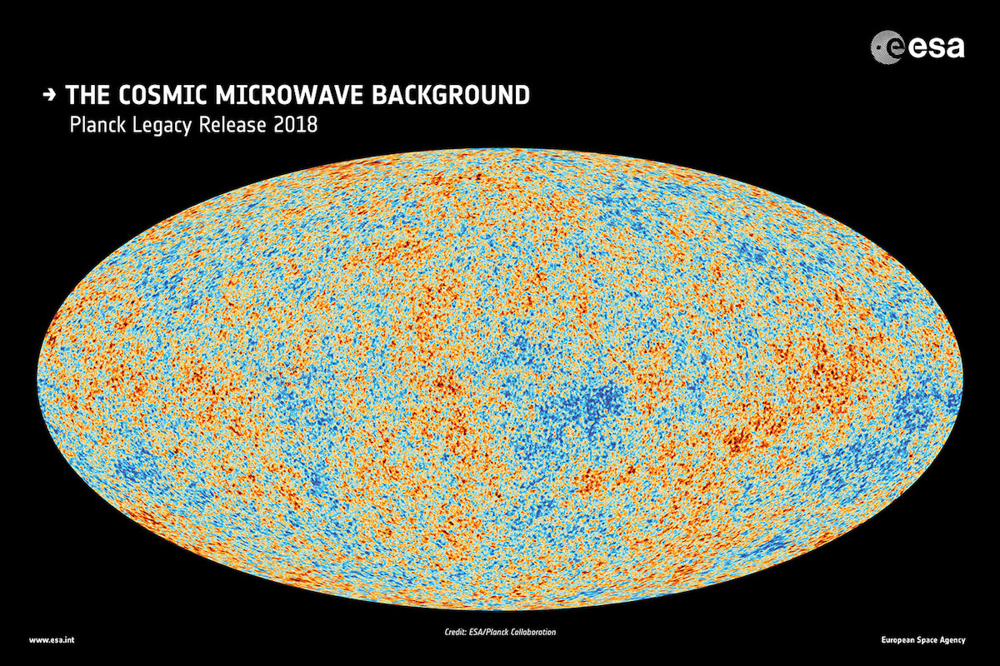
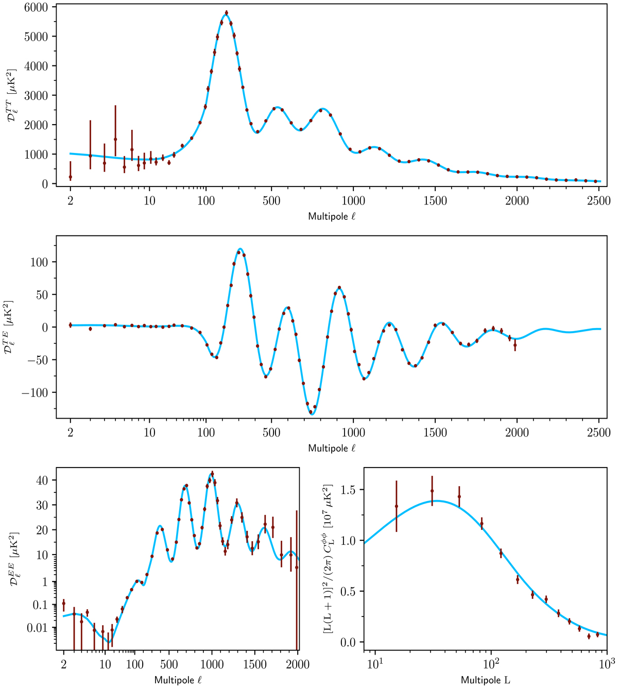
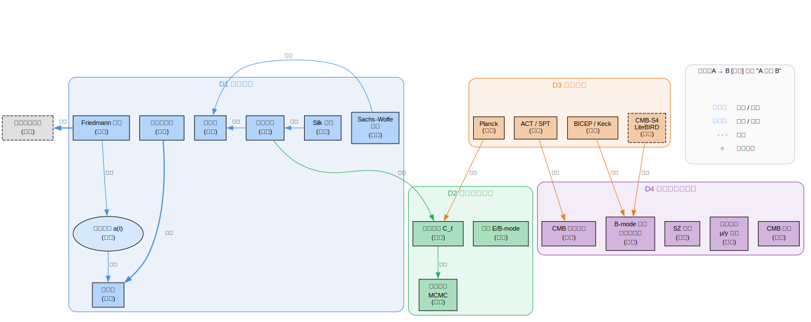

# CMB（宇宙微波背景辐射）

> 创建日期：2026-03-07

## 背景与起点

- **已有知识**：本科物理（力学、电磁、热统、量子力学），无宇宙学基础
- **从哪开始**：膨胀宇宙基础

## 领域概览

CMB 是宇宙大爆炸约 38 万年后释放出的热辐射"余晖"。当时宇宙冷却到 ~3000K，电子与质子复合为氢原子，光子不再被频繁散射，宇宙变得透明。这些光子自由传播至今，被红移到微波波段（~2.725K）。

CMB 是一张宇宙婴儿期的"照片"。它几乎是完美的黑体辐射，但存在约 $10^{-5}$ 量级的温度涨落。这些微小涨落编码了早期宇宙的物理信息——物质密度、组成成分、几何结构，是现代精密宇宙学的基石。

### Planck 卫星观测的 CMB 全天温度图

红色 = 比平均温度稍热，蓝色 = 稍冷。温差仅约 ±200 μK（平均 2.725K 的十万分之一）。这些涨落是今天所有宇宙大尺度结构的种子。

### Planck 角功率谱

最上面一幅（TT）：横轴是多极矩 ℓ（对应角尺度 θ ~ 180°/ℓ），纵轴是涨落功率。一系列清晰的峰 = 重子-光子声波振荡的直接证据。蓝线 = ΛCDM 模型拟合。

## 知识维度

本领域的知识沿 4 个正交维度组织：

| 维度 | 含义 | 核心问题 |
|------|------|---------|
| **D1 物理原理** | 支撑 CMB 的理论物理 | 宇宙怎么膨胀？CMB 怎么产生？涨落从哪来？ |
| **D2 观测量与分析** | 我们测什么、怎么提取信息 | 功率谱怎么算？参数怎么拟合？ |
| **D3 实验技术** | 仪器、观测策略、系统误差 | 哪些实验在做什么？前景怎么去除？ |
| **D4 前沿与开放问题** | 尚未解决的活跃方向 | 原初引力波？频谱畸变？CMB 异常？ |

> **为什么这样分？**
> - D1（物理原理）和 D2（观测分析）分开，因为"为什么有声波振荡"（D1）和"怎么从功率谱峰提取 $\Omega_b$"（D2）是完全不同类型的知识。
> - D3（实验）单独列出，因为 CMB 是一个高度实验驱动的领域，Planck/ACT/SPT/BICEP 各有不同的角分辨率、频段和科学目标。
> - D4（前沿）横跨 D1-D3，但可靠度普遍低于经典内容，单独标出。

## 知识地图

> 概念之间的结构关系见下方关系图。这里只列学习顺序和简要说明。

**前置**：本科物理（热统 + 力学 + 电磁）

| 维度 | 学习顺序 | 一句话说明 |
|------|---------|-----------|
| **D1 物理原理** | Friedmann 方程 → 热历史 → 复合与退耦 → 微扰论 → 声波振荡 | 从膨胀宇宙到 CMB 涨落的核心因果链 |
| **D2 观测量与分析** | 角功率谱 $C_\ell$（大尺度 SW / 中尺度声学峰 / 小尺度 Silk 阻尼）→ 偏振 → 参数提取 MCMC | 从物理效应到 ΛCDM 六参数拟合 |
| **D3 实验技术** | 卫星 COBE→WMAP→Planck / 地面 ACT·SPT·BICEP / 未来 CMB-S4·LiteBIRD | 关键技术：前景分离、去透镜 |
| **D4 前沿** | B-mode · SZ 效应 · 引力透镜 · 频谱畸变 · CMB 异常 | 横跨 D1-D3，可靠度低于经典内容 |

### 关系图

> 源文件：`knowledge-graph.dot`，修改后运行 `./build-graphs.sh` 重新生成。

## 学习路径

| 序号 | 主题 | 维度 | 文件 |
|------|------|------|------|
| 1 | 膨胀宇宙 — Friedmann 方程、尺度因子 | D1 | `02-expanding-universe.md` |
| 2 | 热历史 — 粒子退耦、BBN、物质-辐射等时 | D1 | `03-thermal-history.md` |
| 3 | 复合与退耦 — CMB 为什么存在 | D1 | *待写* |
| 4 | 微扰论与声波振荡 — CMB 涨落的核心机制 | D1 | *待写* |
| 5 | 角功率谱 $C_\ell$ — 从物理到观测量 | D1+D2 | *待写* |
| 6 | 前沿方向详解 | D4 | 见 01-overview.md |

## 推荐资源

### 教材
1. Dodelson & Schmidt,《Modern Cosmology》(2nd ed.) — 最标准的 CMB 教材
2. Weinberg,《Cosmology》— 更偏理论推导

### 入门级
1. Wayne Hu 的 CMB 教学网站 (background.uchicago.edu) — 直觉建立极佳
