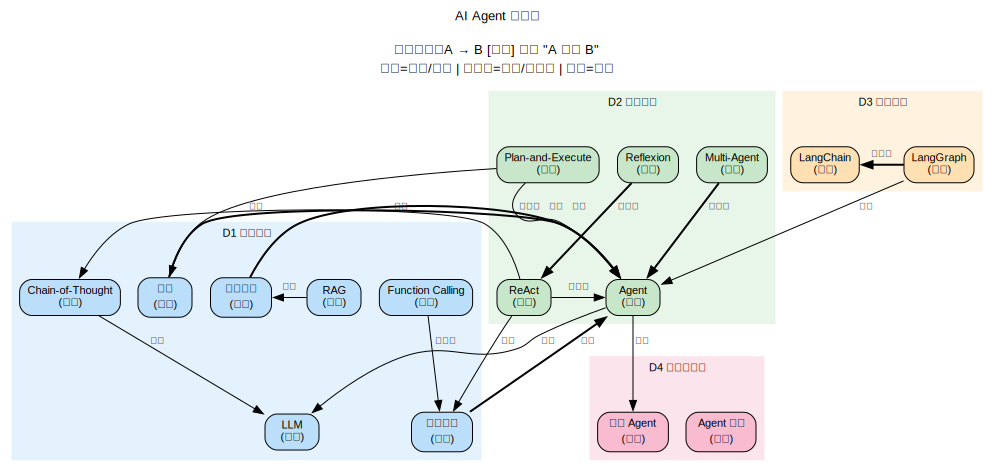

# AI Agent

> 创建日期：2026-03-12

## 背景与起点

- **已有知识**：LLM 全栈理论（Transformer、预训练、微调/对齐、RLHF/DPO），神经网络架构（MLP/CNN/RNN/GNN），用过 Agent 工具但不了解内部原理
- **从哪开始**：Agent 的核心组件（规划、记忆、工具调用），然后到架构模式和工程实现
- **目的**：理解 Agent 设计原理，具备自己搭建 Agent 的能力
- **可跳过**：LLM 基础（已在 `domains/LLM/` 覆盖）、神经网络基础（已在 `domains/neural-networks/` 覆盖）

## 领域概览

AI Agent 是以 LLM 为"大脑"的自主系统：它接收任务，自主规划步骤，调用外部工具执行操作，根据结果调整计划，最终完成任务。和纯 LLM 对话的区别在于：**LLM 只生成文本，Agent 可以行动**。

Agent 的核心等式：**Agent = LLM + 规划 + 记忆 + 工具调用**。LLM 提供推理能力，规划把复杂任务拆解成子步骤，记忆让 Agent 能从历史中学习，工具调用让 Agent 能和外部世界交互（搜索、执行代码、读写文件等）。

当前 Agent 的实践远超理论——很多设计是经验驱动的，理论理解还在追赶。

## 知识维度

| 维度 | 含义 | 核心问题 |
|------|------|---------|
| **D1 核心组件** | Agent 的 building blocks | 规划、记忆、工具调用各自怎么工作？ |
| **D2 架构模式** | Agent 的整体设计范式 | ReAct、Plan-and-Execute、Multi-Agent 各适合什么场景？ |
| **D3 工程实现** | 框架、API、调试、评估 | 怎么用代码把一个 Agent 搭出来？ |
| **D4 应用与前沿** | 实际场景、局限性、未来方向 | Agent 能做什么？不能做什么？ |

> **为什么这样分？**
> - D1（组件）和 D2（架构）是不同抽象层级：工具调用是组件，ReAct 是把组件组装起来的模式
> - D3（实现）关注怎么把设计落地为代码
> - D4（应用）关注实际效果和局限，横跨 D1-D3

## 知识地图

> 概念之间的结构关系见下方关系图。这里只列学习顺序和简要说明。

**前置**：LLM 基础（参见 `domains/LLM/`，特别是 Transformer、预训练、对齐）

| 维度 | 学习顺序 | 一句话说明 |
|------|---------|-----------|
| **D1 核心组件** | 提示与推理 → 工具调用 → 记忆系统 → 规划 | 从最简单的 CoT 到完整的规划系统，逐步增加复杂度 |
| **D2 架构模式** | ReAct → Plan-and-Execute → Multi-Agent → 人机协作 | 从单步推理-行动循环到多 Agent 协作 |
| **D3 工程实现** | Function Calling API → LangChain/LangGraph → 评估与调试 | 从 API 调用到完整框架 |
| **D4 应用与前沿** | 代码 Agent → 研究 Agent → 局限与安全 → 前沿方向 | 典型应用场景，当前瓶颈，未来展望 |

### 关系图

> 源文件：`knowledge-graph.dot`，修改后运行 `./build-graphs.sh` 重新生成。

## 学习路径

| 序号 | 主题 | 维度 | 文件 |
|------|------|------|------|
| 1 | 全景概览 — Agent 是什么、核心组件、发展脉络 | 全部 | `01-overview.md` |
| 2 | 提示与推理 — CoT、Few-shot、ReAct 提示模式 | D1+D2 | `02-prompting-reasoning.md` |
| 3 | 工具调用 — Function Calling、API 设计、工具选择 | D1+D3 | `03-tool-use.md` |
| 4 | 记忆系统 — 短期/长期记忆、RAG、向量数据库 | D1 | `04-memory.md` |
| 5 | 规划 — 任务分解、Plan-and-Execute、自我反思 | D1+D2 | `05-planning.md` |
| 6 | 架构模式 — ReAct、LATS、Multi-Agent、人机协作 | D2 | `06-architectures.md` |
| 7 | 工程实现 — LangChain/LangGraph 实战、构建完整 Agent | D3 | `07-engineering.md` |
| 8 | 评估与调试 — Agent 的测试、Benchmark、常见失败模式 | D3 | `08-evaluation.md` |
| 9 | 应用与前沿 — 代码 Agent、研究 Agent、局限、安全、未来 | D4 | `09-applications-frontiers.md` |

## 推荐资源

### 综述与教程
1. Lilian Weng,["LLM Powered Autonomous Agents"](https://lilianweng.github.io/posts/2023-06-23-agent/)（2023）— 最好的 Agent 概念综述
2. Andrew Ng, [AI Agentic Design Patterns](https://www.deeplearning.ai/the-batch/how-agents-can-improve-llm-performance/)（2024）— 设计模式总结
3. [LangChain 官方文档](https://python.langchain.com/docs/) — 最常用的 Agent 框架

### 论文
1. Yao et al., ["ReAct: Synergizing Reasoning and Acting"](https://arxiv.org/abs/2210.03629)（2022）— Agent 的奠基论文之一
2. Shinn et al., ["Reflexion"](https://arxiv.org/abs/2303.11366)（2023）— 自我反思改进
3. Wang et al., ["A Survey on Large Language Model based Autonomous Agents"](https://arxiv.org/abs/2308.11432)（2023）— 全面综述

### 工具与框架
1. [LangChain](https://python.langchain.com/) / [LangGraph](https://langchain-ai.github.io/langgraph/) — Python Agent 框架
2. [OpenAI Function Calling API](https://platform.openai.com/docs/guides/function-calling) — 工具调用的行业标准
3. [Anthropic Tool Use](https://docs.anthropic.com/en/docs/build-with-claude/tool-use) — Claude 的工具调用
