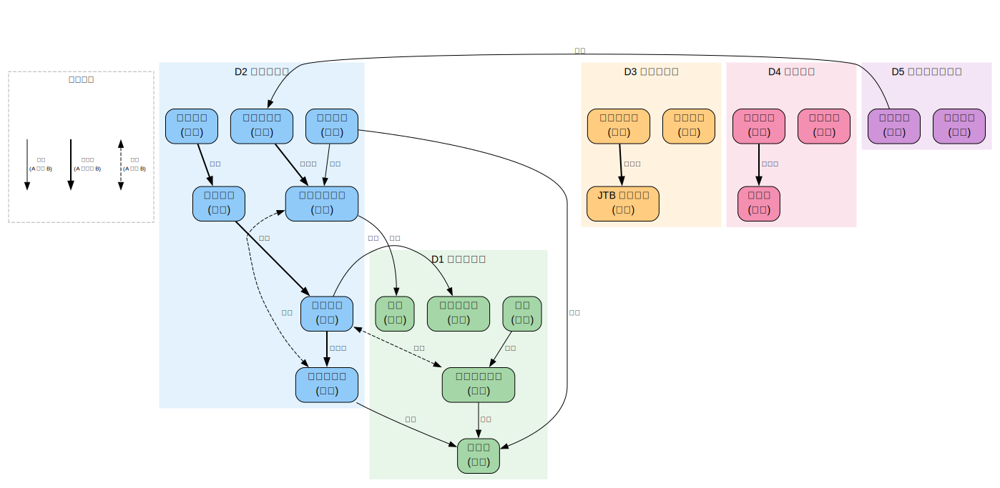

# 分析哲学

> 创建日期：2026-03-12

## 背景与起点

- **已有知识**：无系统西方哲学训练；通过佛教/道教学习接触过休谟（Bundle Theory）、维特根斯坦（"不可说"）、帕菲特（人格同一性）、超协调逻辑等概念；未学过形式逻辑
- **从哪开始**：从"分析哲学是什么"和基础逻辑工具开始
- **目的**：系统理解分析哲学传统的历史发展和核心论证；特别关注语言和交流中的精确性问题——人与人之间如何精确理解对方的意思
- **视角**：学术哲学视角

## 领域概览

分析哲学是 20 世纪以来西方哲学的主流传统（主要在英语世界），其核心特征是：

1. **重视论证的精确性**：哲学主张必须有清晰的论证支持，不能靠直觉或修辞
2. **语言分析**：很多哲学问题的根源是**语言的误用**——把语言搞清楚，哲学问题就解决了一半
3. **逻辑工具**：使用形式逻辑作为分析工具
4. **问题导向**：关注具体问题（如"意义是什么？""知识的条件是什么？"），而非构建宏大体系

你提到的那个困惑——"两个人谈话时术语不一致，怎么精确知道对方的意思"——恰好是分析哲学中语言哲学的核心问题之一。弗雷格、罗素、维特根斯坦、奎因、克里普克都在不同层面讨论过这个问题。

## 知识维度

| 维度 | 含义 | 核心问题 |
|------|------|---------|
| **D1 历史与方法** | 分析哲学的起源、发展和方法论 | 分析哲学从哪来？它的"分析"方法是什么？ |
| **D2 逻辑与语言** | 形式逻辑、语言哲学、意义理论 | 语句的意义是什么？如何精确表达和理解？ |
| **D3 知识与真理** | 认识论、真理理论 | 什么算"知道"？"真"是什么意思？ |
| **D4 心灵哲学** | 意识、意向性、心身问题 | 心灵和身体是什么关系？机器能思考吗？ |
| **D5 形而上学与伦理** | 存在、可能世界、道德哲学 | 什么是"存在"？道德判断是客观的吗？ |

> **为什么这样分？**
> - D1（历史与方法）提供整体框架，理解"分析哲学"本身是什么
> - D2（逻辑与语言）是分析哲学最核心的贡献领域，也是你最关心的
> - D3-D5 是分析哲学方法应用到的主要问题域

## 知识地图

| 维度 | 学习顺序 | 一句话说明 |
|------|---------|-----------|
| **D1 历史与方法** | 弗雷格→罗素→早期维特根斯坦→逻辑实证主义→后期维特根斯坦→奎因→当代 | 从 1879 年弗雷格到当代的 150 年 |
| **D2 逻辑与语言** | 命题逻辑→谓词逻辑→涵义/指称→确定描述→语言游戏→言语行为→意义整体论 | 从"语句怎么为真"到"交流怎么可能" |
| **D3 知识与真理** | JTB 定义→盖梯尔问题→可靠论→真理符合论→融贯论→紧缩论 | 从"知识是什么"到"真理是什么" |
| **D4 心灵哲学** | 二元论→行为主义→同一论→功能主义→中文房间→意识难题 | 从"心身分离"到"意识是什么" |
| **D5 形而上学与伦理** | 可能世界→本质主义→自然种类→元伦理学→规范伦理学 | 从"什么是必然的"到"什么是对的" |

### 关系图

> 源文件：`knowledge-graph.dot`，修改后运行 `./build-graphs.sh` 重新生成。

## 学习路径

| 序号 | 主题 | 维度 | 文件 |
|------|------|------|------|
| 1 | 全景概览 — 什么是分析哲学、知识地图 | 全部 | `01-overview.md` |
| 2 | 逻辑基础 — 命题逻辑、谓词逻辑、论证有效性 | D1+D2 | `02-logic.md` |
| 3 | 弗雷格与罗素 — 现代逻辑的诞生、涵义与指称、确定描述 | D1+D2 | `03-frege-russell.md` |
| 4 | 维特根斯坦 — 《逻辑哲学论》→ 语言游戏 → 私有语言论证 | D1+D2 | `04-wittgenstein.md` |
| 5 | 语言哲学 — 意义理论、言语行为、格赖斯的会话含义 | D2 | `05-philosophy-of-language.md` |
| 6 | 认识论 — 知识的定义、盖梯尔问题、怀疑论 | D3 | `06-epistemology.md` |
| 7 | 心灵哲学 — 心身问题、功能主义、意识 | D4 | `07-philosophy-of-mind.md` |
| 8 | 形而上学 — 可能世界、本质、因果、自由意志 | D5 | `08-metaphysics.md` |
| 9 | 伦理学与当代发展 — 元伦理学、应用伦理、实验哲学 | D5 | `09-ethics-and-contemporary.md` |

## 推荐资源

### 学术入门
1. A.P. Martinich & David Sosa 编,《A Companion to Analytic Philosophy》— 分析哲学百科全书式入门
2. 陈嘉映,《语言哲学》— 最好的中文语言哲学教材
3. 赵汀阳,《论可能生活》— 中文分析哲学风格的伦理学

### 经典原著（有中译）
1. 维特根斯坦,《逻辑哲学论》（贺绍甲 译）
2. 维特根斯坦,《哲学研究》（陈嘉映 译）
3. A.J. Ayer,《语言、真理与逻辑》— 逻辑实证主义的入门经典

### 进阶
1. Michael Dummett,《Frege: Philosophy of Language》— 弗雷格语言哲学的权威解读
2. Saul Kripke,《Naming and Necessity》— 改变了分析哲学走向的三次演讲
3. [Stanford Encyclopedia of Philosophy](https://plato.stanford.edu/) — 最权威的哲学百科全书（免费在线）
