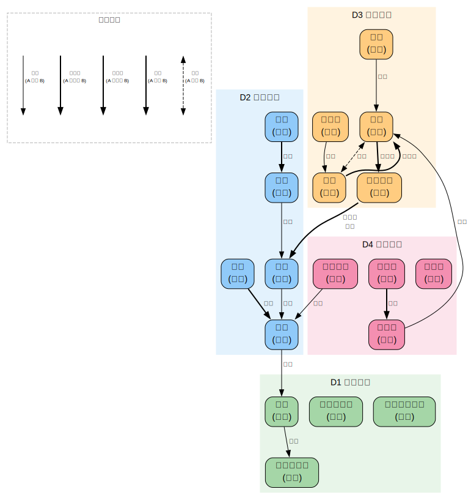

# 佛教哲学与历史

> 创建日期：2026-03-12

## 背景与起点

- **已有知识**：读过金刚经，不了解大乘/小乘区别，无系统佛教知识
- **从哪开始**：佛陀生平和历史背景，然后进入核心教义
- **目的**：从学术角度理解佛教哲学思想体系和历史演变
- **视角**：学术宗教学/哲学视角，非修行视角。区分学术共识与宗派传统叙事

## 领域概览

佛教起源于公元前 5 世纪的印度，由悉达多·乔达摩（后称"佛陀"，意为"觉悟者"）创立。它是一个涵盖哲学、伦理、心理学和修行实践的庞大体系，在 2500 年的传播中发展出多种极不相同的形态——从斯里兰卡的上座部到中国的禅宗到西藏的密宗。

佛教的核心关切是**苦的问题**：人生为什么有苦？苦的根源是什么？怎么消除苦？围绕这个问题，佛教发展出了一套精密的哲学体系，其中"缘起""无我""空性"等概念在哲学史上有独特的地位。

**学术说明**：佛教研究中，"历史上的佛陀到底说了什么"和"经文中记载佛陀说了什么"是两个不同的问题。早期经文（巴利三藏）被认为最接近原始教导，但也经过了数百年口头传承的演变。后期经典（大乘经典）在学术上被认为是后来的创作，但在宗教传统中被视为佛陀的教导。本域会标注这种区别。

## 知识维度

| 维度 | 含义 | 核心问题 |
|------|------|---------|
| **D1 历史脉络** | 佛教的起源、传播与演变 | 佛陀是谁？佛教怎么从印度传到东亚？各地怎么变的？ |
| **D2 核心教义** | 所有佛教宗派共享的基础思想 | 四谛、缘起、无我、涅槃到底在说什么？ |
| **D3 哲学流派** | 不同学派的哲学发展 | 部派佛教、中观、唯识、如来藏、禅宗各自的核心主张和分歧？ |
| **D4 经典文献** | 关键经典及其思想 | 巴利三藏、般若经、金刚经、法华经、心经各说了什么？ |

> **为什么这样分？**
> - D1（历史）提供时间线和背景，是理解 D2-D4 的框架
> - D2（核心教义）是各宗派的"公约数"，需要先掌握才能理解分歧
> - D3（哲学流派）是佛教思想的深度发展，各学派对 D2 的诠释不同
> - D4（经典）是思想的载体，和 D2-D3 交织但有独立的文献学问题

## 知识地图

> 概念之间的结构关系见下方关系图。这里只列学习顺序和简要说明。

**前置**：无特殊前置，但了解古印度历史背景有助于理解

| 维度 | 学习顺序 | 一句话说明 |
|------|---------|-----------|
| **D1 历史脉络** | 佛陀与古印度 → 早期佛教 → 部派分裂 → 大乘兴起 → 向东亚传播 | 从公元前 5 世纪到宋明的 1500 年演变 |
| **D2 核心教义** | 四谛 → 缘起 → 无我 → 五蕴 → 十二因缘 → 涅槃 → 业与轮回 | 所有宗派共享的基础概念体系 |
| **D3 哲学流派** | 说一切有部 → 中观（龙树）→ 唯识（无著/世亲）→ 如来藏 → 禅宗 | 从"一切法有自性"到"一切法空"到"万法唯心" |
| **D4 经典文献** | 巴利三藏 → 般若经系 → 法华经 → 心经/金刚经 → 坛经 | 从最早的经典到中国禅宗的文本 |

### 关系图

> 源文件：`knowledge-graph.dot`，修改后运行 `./build-graphs.sh` 重新生成。

## 学习路径

| 序号 | 主题 | 维度 | 文件 |
|------|------|------|------|
| 1 | 全景概览 — 佛教是什么、知识地图、学术视角 | 全部 | `01-overview.md` |
| 2 | 佛陀与古印度 — 历史背景、悉达多生平、早期僧团 | D1 | `02-buddha-and-india.md` |
| 3 | 核心教义（上）— 四谛、缘起、无我 | D2 | `03-core-doctrines-1.md` |
| 4 | 核心教义（下）— 五蕴、十二因缘、涅槃、业与轮回 | D2 | `04-core-doctrines-2.md` |
| 5 | 部派佛教与大乘兴起 — 从统一到分裂到大乘革命 | D1+D3 | `05-schools-and-mahayana.md` |
| 6 | 中观与唯识 — 龙树的空性哲学、无著世亲的唯识学 | D3 | `06-madhyamaka-yogacara.md` |
| 7 | 经典文献 — 巴利三藏、般若经、金刚经、心经、法华经 | D4 | `07-key-texts.md` |
| 8 | 中国佛教 — 传入、翻译、天台/华严/禅宗/净土 | D1+D3 | `08-chinese-buddhism.md` |
| 9 | 佛教哲学的现代意义 — 与西方哲学的对话、当代争论 | D3+D4 | `09-modern-significance.md` |

## 可靠度说明

本域采用特殊的可靠度标注体系，适应人文学科的特点：

| 级别 | 含义 | 例子 |
|------|------|------|
| Level 1 | 学术共识 | 佛教起源于公元前 5 世纪的印度 |
| Level 2 | 学术主流观点（有少数异议） | 佛陀的大致生卒年代 |
| Level 3 | 学术争论中（多种说法并存） | 大乘佛教的起源机制 |
| Level 4 | 宗派传统说法（学术上不支持） | "大乘经典是佛陀亲说" |

## 推荐资源

### 学术入门
1. Peter Harvey,《An Introduction to Buddhism》(2nd ed.) — 最好的学术入门教材
2. Rupert Gethin,《The Foundations of Buddhism》— 侧重教义和哲学
3. 吕澂,《印度佛学源流略讲》— 中文学术经典

### 原典翻译
1. [Access to Insight](https://www.accesstoinsight.org/) — 巴利三藏英译（上座部传统）
2. [SuttaCentral](https://suttacentral.net/) — 多语言佛经对照
3. 鸠摩罗什 译,《金刚般若波罗蜜经》— 最流通的中文金刚经译本

### 哲学进阶
1. Mark Siderits,《Buddhism as Philosophy》— 用分析哲学方法讨论佛教
2. Jay Garfield,《The Fundamental Wisdom of the Middle Way》— 龙树《中论》英译+哲学注解
