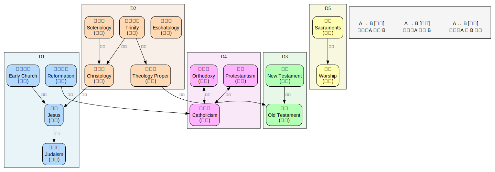

# 基督教（Christianity）

> 创建日期：2026-04-02

## 背景与起点

- **已有知识**：知道耶稣、圣经、十字架等基本文化符号，但没有系统学过神学或教会史
- **从哪开始**：从犹太教背景和耶稣生平开始，然后进入核心教义
- **目的**：从学术角度理解基督教的思想体系、历史演变和教派分化
- **视角**：学术宗教学/神学研究视角，非信仰视角。区分学术共识与教派传统叙事

## 领域概览

基督教是世界上信徒最多的宗教（约 24 亿人，占全球人口 31%），起源于 1 世纪的巴勒斯坦地区。它以拿撒勒人耶稣的生平、教导、死亡和（信徒所信的）复活为核心，从犹太教中脱胎而出，在罗马帝国中发展壮大，最终成为西方文明的基础性力量。

基督教的核心关切是**神与人的关系**：全能的上帝为什么创造人类？人为什么会犯罪？上帝如何通过耶稣基督实现救赎？围绕这些问题，基督教发展出了一套庞大的神学体系，并在 2000 年的历史中分化为天主教、东正教、新教等多种传统。

**学术说明**：基督教研究中，"历史上的耶稣"和"信仰中的基督"是两个不同的问题。现代圣经学（Biblical Studies）用文本批评、考古学和历史学方法研究圣经文本的形成过程，其结论常与传统教会教导不同。本域会标注这种区别。

## 知识维度

| 维度 | 含义 | 核心问题 |
|------|------|---------|
| **D1 历史脉络** | 基督教的起源、传播与演变 | 基督教怎么从犹太教中产生？怎么成为罗马国教？怎么分裂？ |
| **D2 核心教义** | 各主要教派共享的基础神学 | 三位一体、道成肉身、救赎、末世论到底在说什么？ |
| **D3 经典文献** | 圣经及其诠释传统 | 旧约新约各说了什么？怎么形成的？不同教派怎么读经？ |
| **D4 教派与传统** | 三大传统及其差异 | 天主教、东正教、新教在体制、神学、礼仪上有何不同？ |
| **D5 礼仪与实践** | 崇拜、圣礼与伦理生活 | 基督徒怎么做礼拜？圣餐是什么？基督教伦理的基础是什么？ |

> **为什么这样分？**
> - D1（历史）提供时间线和背景，是理解 D2-D5 的框架
> - D2（核心教义）是各教派的"公约数"，需要先掌握才能理解分歧
> - D3（经典）是教义的来源和载体，与 D2 交织但有独立的文献学问题
> - D4（教派）是基督教的外在多样性，需要 D1+D2 的基础
> - D5（实践）是教义的外在表达，贯穿各教派但形式各异

## 知识地图

> 概念之间的结构关系见下方关系图。这里只列学习顺序和简要说明。

**前置**：无特殊前置，但了解古代近东和希腊罗马文化有助于理解

| 维度 | 学习顺序 | 一句话说明 |
|------|---------|-----------|
| **D1 历史脉络** | 古以色列与犹太教 → 耶稣与福音书 → 早期教会 → 基督教帝国化 → 东西分裂 → 宗教改革 → 现代 | 从公元前 2000 年到 21 世纪的 4000 年跨度 |
| **D2 核心教义** | 上帝论 → 基督论 → 三位一体 → 救赎论 → 罪与恩典 → 末世论 | 神学的核心架构，各教派共享但诠释不同 |
| **D3 经典文献** | 旧约概览 → 新约概览 → 正典化过程 → 诠释学传统 | 从希伯来圣经到新约的形成与阅读方法 |
| **D4 教派与传统** | 天主教 → 东正教 → 新教（路德宗、改革宗、圣公会、浸信会等）| 三大传统的组织、神学和礼仪差异 |
| **D5 礼仪与实践** | 洗礼 → 圣餐 → 崇拜 → 教会年历 → 基督教伦理 | 信仰的外在表达与日常实践 |

### 关系图

> 源文件：`knowledge-graph.dot`，修改后运行 `./build-graphs.sh` 重新生成。

## 学习路径

| 序号 | 主题 | 维度 | 文件 |
|------|------|------|------|
| 1 | 全景概览 — 基督教是什么、知识地图、学术视角 | 全部 | `01-overview.md` |
| 2 | 古以色列与犹太教 — 旧约背景、一神论、盟约 | D1+D3 | `02-ancient-israel.md` |
| 3 | 耶稣与福音书 — 历史上的耶稣、教导、死亡与复活 | D1+D3 | `03-jesus-and-gospels.md` |
| 4 | 核心教义（上）— 上帝论、三位一体、基督论 | D2 | `04-core-doctrines-1.md` |
| 5 | 核心教义（下）— 救赎论、罪与恩典、末世论 | D2 | `05-core-doctrines-2.md` |
| 6 | 早期教会与信经 — 使徒时代、大公会议、信经形成 | D1+D2 | `06-early-church.md` |
| 7 | 中世纪与东方基督教 — 东西分裂、经院哲学、修道运动、东正教 | D1+D4 | `07-medieval-and-eastern.md` |
| 8 | 宗教改革与教派分化 — 路德、加尔文、圣公会、反宗教改革 | D1+D4 | `08-reformation.md` |
| 9 | 现代基督教 — 普世运动、当代神学、基督教伦理与实践 | D4+D5 | `09-modern-christianity.md` |

## 可靠度说明

本域采用与佛教域一致的特殊可靠度标注体系，适应人文学科的特点：

| 级别 | 含义 | 例子 |
|------|------|------|
| Level 1 | 学术共识 | 保罗书信写于 1 世纪 50 年代 |
| Level 2 | 学术主流观点（有少数异议） | 耶稣大约在公元前 4 年出生 |
| Level 3 | 学术争论中（多种说法并存） | 保罗神学与耶稣教导的关系 |
| Level 4 | 教派传统说法（学术上有争议） | "四福音书都是使徒本人所写" |

## 推荐资源

### 学术入门
1. Alister McGrath,《Christianity: An Introduction》(3rd ed.) — 最好的学术入门教材
2. Diarmaid MacCulloch,《Christianity: The First Three Thousand Years》— 权威通史
3. 卓新平,《基督教概论》— 中文学术入门

### 圣经相关
1. [Bible Gateway](https://www.biblegateway.com/) — 多版本圣经在线阅读
2. Bart Ehrman,《The New Testament: A Historical Introduction》— 新约历史批评入门
3. 和合本圣经 — 中文最通行的圣经译本

### 神学进阶
1. Wayne Grudem,《Systematic Theology》— 系统神学入门（福音派视角）
2. Jaroslav Pelikan,《The Christian Tradition》(5 vols.) — 教义史经典
3. Hans Küng,《Christianity: Essence, History, and Future》— 天主教改革派视角
