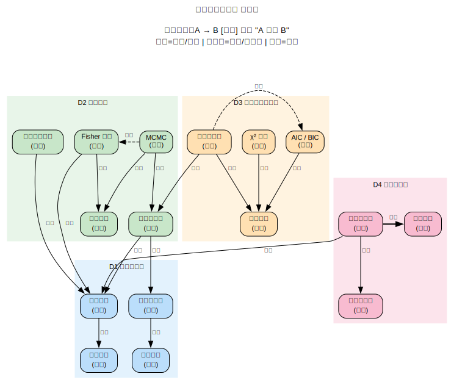

# 宇宙学统计方法

> 创建日期：2026-03-12

## 背景与起点

- **已有知识**：本科概率论与数理统计（需要复习），宇宙学基础（Friedmann 方程、热历史，参见 `domains/CMB/`），有 MCMC 实战经验（CosmoMC + kSZ 参数估计），但理论理解不深
- **从哪开始**：概率论快速复习，然后进入贝叶斯推断和 MCMC 理论
- **目的**：系统理解参数估计的统计原理，学会解读实验结果（包括 PTE 等拟合优度指标），了解更广泛的统计方法（模型选择、假设检验等）
- **可跳过**：概率论中的初等内容（排列组合、古典概型），宇宙学物理基础（已在 `domains/CMB/` 覆盖）

## 领域概览

宇宙学是一门数据驱动的科学——我们无法重复宇宙的演化实验，只有一个宇宙可以观测。统计方法是从有限、有噪声的观测数据中提取物理信息的核心工具。

参数估计（Parameter Estimation）的核心问题：**给定观测数据 $\mathbf{d}$ 和理论模型 $M(\boldsymbol{\theta})$，宇宙学参数 $\boldsymbol{\theta}$（如 $H_0$, $\Omega_m$, $\sigma_8$）的最佳估计值和不确定性是什么？**

这个问题连接了两个世界：物理理论（预测功率谱）和观测数据（测量功率谱），而统计方法是桥梁。

## 知识维度

| 维度 | 含义 | 核心问题 |
|------|------|---------|
| **D1 概率论基础** | 统计推断的数学基础 | 概率分布、贝叶斯定理、似然函数怎么工作？ |
| **D2 参数估计** | 参数估计的核心方法 | 贝叶斯推断、MCMC、Fisher 矩阵各自的原理和适用场景？ |
| **D3 模型选择与检验** | 超越参数估计的统计问题 | 怎么比较不同模型？怎么判断拟合好不好？ |
| **D4 宇宙学应用** | 统计方法在宇宙学中的具体实现 | 功率谱似然怎么构建？实际论文中的结果怎么解读？ |

> **为什么这样分？**
> - D1 是数学基础，D2-D4 都依赖它
> - D2（参数估计）和 D3（模型选择）是两类不同的统计问题：前者问"参数是多少"，后者问"哪个模型更好"
> - D4（宇宙学应用）把 D1-D3 的抽象方法落地到具体的宇宙学数据分析中

## 知识地图

> 概念之间的结构关系见下方关系图。这里只列学习顺序和简要说明。

**前置**：本科微积分 + 线性代数 + 基础概率论

| 维度 | 学习顺序 | 一句话说明 |
|------|---------|-----------|
| **D1 概率论基础** | 概率分布复习 → 贝叶斯定理 → 似然函数 → 充分统计量 | 从基本概率到统计推断的语言 |
| **D2 参数估计** | 最大似然估计 → 贝叶斯推断 → MCMC → Fisher 矩阵 → 收敛诊断 | 从点估计到完整后验分布的采样 |
| **D3 模型选择** | $\chi^2$ 拟合优度 → 贝叶斯证据 → 信息准则（AIC/BIC） → 频率学派 vs 贝叶斯 | 从"参数是多少"到"哪个模型更好" |
| **D4 宇宙学应用** | 功率谱似然 → 协方差矩阵 → 退化与先验 → 实际论文解读 → 系统误差 | 把方法落地到 CMB / kSZ / LSS 数据 |

### 关系图

> 源文件：`knowledge-graph.dot`，修改后运行 `./build-graphs.sh` 重新生成。

## 学习路径

| 序号 | 主题 | 维度 | 文件 |
|------|------|------|------|
| 1 | 全景概览 — 统计在宇宙学中的角色 | 全部 | `01-overview.md` |
| 2 | 概率论复习 — 分布、条件概率、贝叶斯定理 | D1 | `02-probability-review.md` |
| 3 | 似然函数与最大似然估计 | D1+D2 | `03-likelihood-mle.md` |
| 4 | 贝叶斯推断 — 先验、后验、可信区间 | D2 | `04-bayesian-inference.md` |
| 5 | MCMC — 原理、Metropolis-Hastings、收敛诊断 | D2 | `05-mcmc.md` |
| 6 | Fisher 矩阵 — 参数预测与退化分析 | D2 | `06-fisher-matrix.md` |
| 7 | 模型选择 — 证据、AIC/BIC、拟合优度 | D3 | `07-model-selection.md` |
| 8 | 宇宙学似然 — 功率谱、协方差、实际流程 | D4 | `08-cosmological-likelihood.md` |
| 9 | 结果解读 — 等高线图、张力、论文实例 | D4 | `09-results-interpretation.md` |

## 推荐资源

### 教材
1. D.S. Sivia,《Data Analysis: A Bayesian Tutorial》— 贝叶斯入门经典，物理学家视角
2. R. Trotta, ["Bayes in the sky"](https://arxiv.org/abs/0803.4089)（2008）— 宇宙学贝叶斯统计最佳综述
3. A.R. Liddle, ["Information criteria for astrophysical model selection"](https://arxiv.org/abs/0701113)（2007）— 模型选择方法综述

### 讲义与教程
1. A. Lewis,《CosmoMC 文档》— MCMC 在宇宙学中的标准实现
2. D. Foreman-Mackey, ["emcee: The MCMC Hammer"](https://arxiv.org/abs/1202.3665)（2013）— Affine-invariant MCMC
3. M. Hobson et al.,《Bayesian Methods in Cosmology》— Cambridge 出版的宇宙学贝叶斯方法专著

### 工具
1. [CosmoMC](https://cosmologist.info/cosmomc/) / [Cobaya](https://cobaya.readthedocs.io/) — 宇宙学 MCMC 标准工具
2. [emcee](https://emcee.readthedocs.io/) — Python MCMC 库
3. [GetDist](https://getdist.readthedocs.io/) — 后验分布可视化（等高线图）
