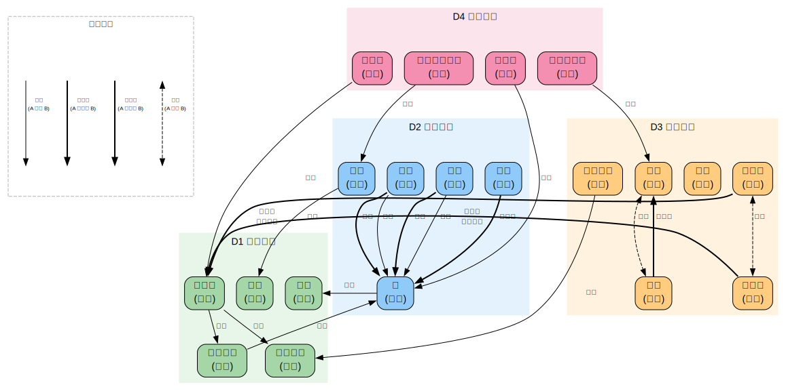

# 道家哲学与道教

> 创建日期：2026-03-12

## 背景与起点

- **已有知识**：读过些《道德经》，庄子接触少，不了解道家/道教的区别
- **从哪开始**：先分清道家和道教，然后从先秦道家哲学入手
- **目的**：从学术角度理解道家哲学体系和道教历史演变
- **视角**：学术宗教学/哲学视角

## 领域概览

"道家"和"道教"在中文里经常混用，但在学术上是两个不同层次的概念：

- **道家**（Daoism as philosophy）：先秦时期以老子、庄子为代表的哲学传统，核心关切是"道"的本质和人应该如何生活
- **道教**（Daoism as religion）：东汉末年开始形成的宗教组织体系，融合了道家哲学、民间信仰、方术、阴阳五行等多种元素

两者的关系复杂——道教尊老子为教祖、以《道德经》为核心经典，但道教的很多内容（神仙信仰、炼丹术、科仪）在老庄那里是找不到的。学术上通常用 "Daojia"（道家）和 "Daojiao"（道教）来区分。

## 知识维度

| 维度 | 含义 | 核心问题 |
|------|------|---------|
| **D1 历史脉络** | 道家和道教的起源、发展与演变 | 道家怎么从先秦哲学变成汉代之后的宗教？各朝代怎么演变？ |
| **D2 哲学思想** | 道家作为哲学传统的核心思想 | 道、无为、齐物、玄学——这些概念到底在说什么？ |
| **D3 宗教体系** | 道教作为宗教的信仰、仪式和修炼体系 | 神仙信仰、内丹外丹、科仪、教团组织是怎么回事？ |
| **D4 经典文献** | 关键文本及其思想 | 《道德经》《庄子》《太平经》《周易参同契》各说了什么？ |

> **为什么这样分？**
> - D1（历史）提供时间线，是理解 D2-D4 的框架
> - D2（哲学）是道家最有学术影响力的部分，先秦道家哲学在世界哲学中有独特地位
> - D3（宗教）是道教作为一个活的宗教传统的面貌，与纯哲学有很大不同
> - D4（经典）是思想的载体，既有文献学问题也有思想解读问题

## 知识地图

> 概念之间的结构关系见下方关系图。这里只列学习顺序和简要说明。

| 维度 | 学习顺序 | 一句话说明 |
|------|---------|-----------|
| **D1 历史脉络** | 先秦背景 → 秦汉方术 → 道教创立 → 南北朝发展 → 唐宋兴盛 → 金元全真派 | 从哲学到宗教的 2000 年演变 |
| **D2 哲学思想** | 道论 → 无为/自然 → 齐物论 → 黄老之学 → 魏晋玄学 → 重玄学 | 从老子的"道"到后世哲学的深化 |
| **D3 宗教体系** | 神仙信仰 → 外丹 → 内丹 → 科仪 → 教团组织 → 全真/正一 | 从长生追求到成熟的宗教体系 |
| **D4 经典文献** | 《道德经》→《庄子》→《太平经》→《周易参同契》→《抱朴子》→《道藏》 | 从哲学经典到宗教经典的谱系 |

### 关系图

> 源文件：`knowledge-graph.dot`，修改后运行 `./build-graphs.sh` 重新生成。

## 学习路径

| 序号 | 主题 | 维度 | 文件 |
|------|------|------|------|
| 1 | 全景概览 — 道家与道教的区别、知识地图 | 全部 | `01-overview.md` |
| 2 | 老子与《道德经》 — 道论、无为、反智 | D2+D4 | `02-laozi.md` |
| 3 | 庄子 — 齐物、逍遥、无用之用 | D2+D4 | `03-zhuangzi.md` |
| 4 | 先秦至汉代 — 黄老之学、方术、阴阳五行 | D1+D2 | `04-pre-qin-to-han.md` |
| 5 | 道教的创立 — 天师道、太平道、葛洪 | D1+D3 | `05-founding.md` |
| 6 | 魏晋玄学与上清灵宝 — 哲学复兴与道教经典化 | D1+D2+D3 | `06-xuanxue-shangqing.md` |
| 7 | 内丹与修炼 — 从外丹到内丹的转型 | D3 | `07-alchemy.md` |
| 8 | 唐宋至明清 — 全真派、正一派、三教合一 | D1+D3 | `08-tang-to-qing.md` |
| 9 | 道家哲学的现代意义 — 生态、政治哲学、与西方对话 | D2 | `09-modern-significance.md` |

## 可靠度说明

| 级别 | 含义 | 例子 |
|------|------|------|
| Level 1 | 学术共识 | 《道德经》是先秦文本 |
| Level 2 | 学术主流观点（有少数异议） | 老子的历史性问题 |
| Level 3 | 学术争论中（多种说法并存） | 《道德经》的成书过程 |
| Level 4 | 宗教传统说法（学术上不支持） | "老子西出函谷关化胡为佛" |

## 推荐资源

### 学术入门
1. Livia Kohn,《Daoism and Chinese Culture》— 最好的英文学术入门
2. 任继愈 主编,《中国道教史》— 中文学术标准参考
3. 陈鼓应,《老子注译及评介》— 《道德经》的学术注释

### 原典
1. 陈鼓应,《庄子今注今译》— 《庄子》的现代注译
2. 王弼 注,《老子道德经注》— 最有影响力的古典注释
3. [中国哲学书电子化计划](https://ctext.org/) — 先秦文献数据库

### 进阶
1. 葛兆光,《中国思想史》第一卷 — 将道家放在整体思想史中理解
2. Isabelle Robinet,《Taoism: Growth of a Religion》— 道教史的学术经典
3. A.C. Graham,《Disputers of the Tao》— 先秦哲学的分析性研究
