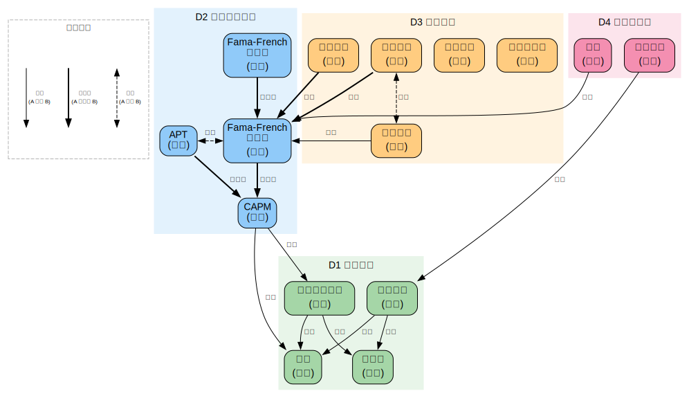

# 多因子模型

> 创建日期：2026-03-12

## 背景与起点

- **已有知识**：数学/统计基础良好（线性回归、矩阵运算、概率论、贝叶斯推断、MCMC——从宇宙学统计域学过）；金融知识从零开始
- **从哪开始**：先补金融基础概念（收益率、风险、投资组合），再进入因子模型
- **目的**：学术研究 + 实际投资赚钱
- **可跳过**：线性回归、矩阵运算、概率论基础（已在宇宙学统计域覆盖，参见 `domains/cosmological-statistics/`）

## 领域概览

多因子模型试图回答金融学中最核心的问题之一：**为什么不同的资产有不同的预期收益率？**

直觉：承担更多风险的投资者应该获得更高的收益作为补偿。但"风险"到底是什么？怎么度量？这就是因子模型要解决的。

- **单因子时代**：CAPM（资本资产定价模型）说风险只有一种——市场风险（beta）
- **多因子时代**：Fama-French 等人发现市场 beta 远不能解释所有收益差异，还有其他"因子"（如价值、规模、动量）也能系统性地解释收益
- **实操时代**：把因子研究变成实际的投资策略——构建因子组合、回测、风控

## 知识维度

| 维度 | 含义 | 核心问题 |
|------|------|---------|
| **D1 金融基础** | 收益率、风险、投资组合理论 | 什么是收益率和风险？怎么衡量？怎么组合资产降低风险？ |
| **D2 因子定价理论** | CAPM → APT → Fama-French → 多因子框架 | 资产的预期收益率由什么决定？ |
| **D3 因子实证** | 具体因子的发现、构建和检验 | 价值、动量、规模等因子是怎么找到的？还管用吗？ |
| **D4 实操与应用** | 数据、编程、回测、组合管理 | 怎么用代码构建因子组合并赚钱？ |

## 知识地图

| 维度 | 学习顺序 | 一句话说明 |
|------|---------|-----------|
| **D1 金融基础** | 收益率 → 风险度量 → 投资组合理论（Markowitz）→ 有效前沿 | 从"股票涨跌"到"最优组合" |
| **D2 因子定价理论** | CAPM → 实证检验与失败 → APT → Fama-French 三因子 → 五因子 → q-factor | 从"只有 beta"到"多个 beta" |
| **D3 因子实证** | 价值因子 → 动量因子 → 规模因子 → 质量因子 → 低波动 → 因子拥挤与衰减 | 每个因子的逻辑、构建和争议 |
| **D4 实操与应用** | 数据源 → 因子构建 → 回测框架 → 组合优化 → 风控 | 从论文到实盘 |

### 关系图

> 源文件：`knowledge-graph.dot`，修改后运行 `./build-graphs.sh` 重新生成。

## 学习路径

| 序号 | 主题 | 维度 | 文件 |
|------|------|------|------|
| 1 | 全景概览 — 什么是因子模型、为什么重要 | 全部 | `01-overview.md` |
| 2 | 金融基础 — 收益率、风险、投资组合理论 | D1 | `02-finance-basics.md` |
| 3 | CAPM — 资本资产定价模型 | D1+D2 | `03-capm.md` |
| 4 | 从 CAPM 到多因子 — APT、Fama-French 三因子 | D2 | `04-multi-factor-theory.md` |
| 5 | 经典因子（上）— 价值、规模、动量 | D2+D3 | `05-classic-factors-1.md` |
| 6 | 经典因子（下）— 质量、低波动、投资 | D2+D3 | `06-classic-factors-2.md` |
| 7 | 因子检验与争议 — 统计检验、因子动物园、p-hacking | D3 | `07-factor-testing.md` |
| 8 | 因子投资实操 — 数据、构建、回测、Python | D4 | `08-implementation.md` |
| 9 | 前沿与应用 — 机器学习因子、另类数据、中国市场 | D3+D4 | `09-frontiers.md` |

## 可靠度说明

| 级别 | 含义 | 例子 |
|------|------|------|
| Level 1 | 教科书共识 | CAPM 的数学推导 |
| Level 2 | 学术主流（有少数异议） | Fama-French 三因子模型的有效性 |
| Level 3 | 学术争论中 | 动量因子的来源解释（风险 vs 行为） |
| Level 4 | 业界经验 | 因子拥挤的判断标准 |

## 推荐资源

### 学术入门
1. Andrew Ang,《Asset Management: A Systematic Approach to Factor Investing》— 因子投资的学术入门圣经
2. John Cochrane,《Asset Pricing》— 资产定价的研究生教材（数学要求高但解释清晰）
3. Bali, Engle & Murray,《Empirical Asset Pricing》— 实证资产定价方法论

### 经典论文
1. Fama & French (1993), "Common risk factors in the returns on stocks and bonds" — 三因子模型原论文
2. Carhart (1997), "On Persistence in Mutual Fund Performance" — 加入动量的四因子模型
3. Fama & French (2015), "A five-factor model" — 五因子模型

### 实操
1. [Kenneth French Data Library](https://mba.tuck.dartmouth.edu/pages/faculty/ken.french/data_library.html) — Fama-French 因子数据（免费）
2. Stefan Jansen,《Machine Learning for Algorithmic Trading》— ML + 因子投资实操
3. [Quantopian Lectures](https://gist.github.com/ih2502mk/50d8f7feb614c8676383431b056f4291) — 量化投资 Python 教程
