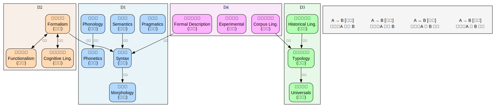

# 理论语言学（Theoretical Linguistics）

> 创建日期：2026-03-11

## 背景与起点

- **已有知识**：零基础，会中文和英文
- **从哪开始**：从概览开始，然后进入语音学与音系学（最具体的层次）
- **目的**：了解人类语言有什么共性、怎么量化描述语言结构

## 领域概览

理论语言学是用科学方法研究人类语言的规律。不是教你怎么学外语，而是回答"7000+ 种人类语言背后有什么共同的结构"。

语言可以像洋葱一样逐层剥开分析：声音（语音学）→ 声音系统（音系学）→ 词的结构（形态学）→ 句子结构（句法学）→ 意义（语义学）→ 语境中的意义（语用学）。

## 知识维度

| 维度 | 含义 | 核心问题 |
|------|------|---------|
| **D1 语言分析层次** | 语言的六个分析层面 | 声音、词、句子、意义各自遵循什么规则？ |
| **D2 理论视角** | 不同学派的解释框架 | 语法是自治的规则系统，还是交际功能的产物？ |
| **D3 跨语言共性** | 类型学与语言共性 | 人类语言有什么共同的结构？差异的边界在哪？ |
| **D4 方法与量化** | 研究工具与方法论 | 怎么用形式化和统计手段描述语言？ |

## 知识地图

> 概念之间的结构关系见下方关系图。这里只列学习顺序和简要说明。

| 维度 | 学习顺序 | 一句话说明 |
|------|---------|-----------|
| **D1 语言分析层次** | 语音学 → 音系学 → 形态学 → 句法学 → 语义学 → 语用学 | 从最具体（声音）到最抽象（意义），逐层上升 |
| **D2 理论视角** | 形式主义 → 功能主义 → 认知语言学 | 先学主流框架，再看其他视角作为对比 |
| **D3 跨语言共性** | 语言类型学 → 语言共性 → 历史语言学 | 有了各层次的基础知识后，才能有意义地比较 |
| **D4 方法与量化** | 形式化描写 → 语料库方法 → 实验方法 | 贯穿始终，但需要基础后才能深入 |

### 关系图

> 源文件：`knowledge-graph.dot`，修改后运行 `./build-graphs.sh` 重新生成。

## 学习路径

| 序号 | 主题 | 维度 | 文件 |
|------|------|------|------|
| 1 | 概览 — 语言学是什么、维度、路线 | 全部 | `01-overview.md` |
| 2 | 语音学与音系学 — 声音的物理与系统 | D1 | `02-phonetics-phonology.md` |
| 3 | 形态学 — 词的内部结构 | D1 | `03-morphology.md` |
| 4 | 句法学 — 句子怎么组装 | D1+D2 | `04-syntax.md` |
| 5 | 语义学与语用学 — 意义从哪来 | D1 | `05-semantics-pragmatics.md` |
| 6 | 语言类型学与共性 — 7000 种语言的共同点 | D3 | `06-typology.md` |
| 7 | 方法与量化 — 形式化、语料库、实验 | D4 | `07-methods.md` |

## 推荐资源

### 教材
1. Fromkin et al.,《An Introduction to Language》— 最经典的入门教材
2. Yule,《The Study of Language》— 更薄、更通俗

### 在线课程
1. [MIT OCW 24.900 Introduction to Linguistics](https://ocw.mit.edu/courses/24-900-introduction-to-linguistics-fall-2012/) — 免费
2. [Crash Course Linguistics](https://www.youtube.com/playlist?list=PL8dPuuaLjXtP5mp25nStsuDU9E5IS0sWj) — YouTube 视频系列

### 工具
1. [IPA Chart](https://www.internationalphoneticassociation.org/content/ipa-chart) — 国际音标表
2. [WALS Online](https://wals.info/) — 世界语言结构地图（跨语言类型学数据库）
