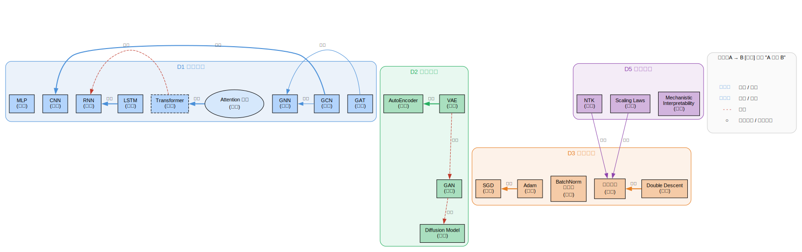

# 神经网络（Neural Networks）

> 创建日期：2026-03-07

## 背景与起点

- **已有知识**：本科物理（线性代数、微积分、概率论），已学过 LLM/02 的神经网络基础（神经元、MLP、损失函数、反向传播、梯度下降）
- **从哪开始**：深入 MLP 的数学细节，然后展开各种架构
- **目的**：理解各种网络架构的设计思想、训练的数学理论、具备动手实现的能力

## 领域概览

神经网络是一族参数化的函数，通过多层非线性变换将输入映射到输出。它的力量来自两件事：（1）结构上足够灵活（万能近似），（2）有高效的训练算法（反向传播 + 梯度下降）。

不同的问题需要不同的网络结构：图像用 CNN（利用空间局部性），序列用 RNN/Transformer（利用时序结构），图数据用 GNN。理解"为什么这个结构适合这个问题"是学习各种架构的核心线索。

同时，神经网络为什么在理论上应该不工作（参数远多于数据，经典统计理论预测必然过拟合）却在实践中表现极好——这是深度学习理论要回答的核心问题。

## 知识维度

本领域的知识沿 5 个正交维度组织：

| 维度 | 含义 | 核心问题 |
|------|------|---------|
| **D1 基础架构** | 网络的计算结构（building blocks） | 怎么处理不同类型的数据？ |
| **D2 训练范式** | 怎么组织训练过程 | 没有标签 / 想生成数据时怎么训练？ |
| **D3 训练数学** | 优化与泛化的理论 | 为什么梯度下降能找到好解？为什么不过拟合？ |
| **D4 工程实现** | 框架与实战技巧 | 怎么把想法变成能跑的代码？ |
| **D5 前沿理论** | 尚未完全解决的开放问题 | Scaling Laws、NTK、可解释性…… |

> **为什么这样分？**
> - D1（架构）和 D2（范式）是初学者最容易混淆的：CNN 是架构，GAN 是范式。DCGAN = CNN（D1）+ GAN（D2）。
> - D3（理论）和 D4（实现）是不同抽象层面。
> - D5（前沿）里的问题横跨 D1-D4，但可靠度普遍低于教科书内容，单独标出以提醒。

## 知识地图

> 概念之间的结构关系见下方关系图。这里只列学习顺序和简要说明。

**前置**：LLM/02 基础（神经元、MLP、损失函数、反向传播、梯度下降）→ 深入 MLP

| 维度 | 学习顺序 | 一句话说明 |
|------|---------|-----------|
| **D1 基础架构** | MLP → CNN → RNN/LSTM → Transformer → GNN | 每种架构 = 不同的 inductive bias（空间局部性 / 时序依赖 / 注意力 / 图结构） |
| **D2 训练范式** | 监督学习 → AutoEncoder → VAE → GAN → Diffusion | 范式可搭配任意 D1 架构（例：DCGAN = CNN + GAN） |
| **D3 训练数学** | 优化理论 → 初始化与归一化 → 正则化 → 泛化理论 | 为什么梯度下降找到好解？为什么过参数化不过拟合？ |
| **D4 工程实现** | PyTorch 基础 → 手写网络 → 训练技巧 | 从想法到能跑的代码 |
| **D5 前沿理论** | Scaling Laws · Double Descent · NTK · 可解释性 | 横跨 D1-D4，可靠度低于教科书 |

### 关系图

> 源文件：`knowledge-graph.dot`，修改后运行 `./build-graphs.sh` 重新生成。

## 学习路径

| 序号 | 主题 | 维度 | 文件 |
|------|------|------|------|
| 1 | 深入 MLP — 初始化、BatchNorm、残差连接、Adam | D1+D3 | `02-deep-mlp.md` |
| 2 | CNN — 卷积、池化、感受野，LeNet → ResNet | D1 | `03-cnn.md` |
| 3 | RNN 与 LSTM — 序列建模、门控机制 | D1 | `04-rnn-lstm.md` |
| 4 | 训练的数学 — 损失面、SGD 收敛、优化器推导 | D3 | `05-training-math.md` |
| 5 | 正则化与泛化 — 过参数化、double descent | D3 | `06-generalization.md` |
| 6 | PyTorch 实战 — 从零手写 MLP/CNN/Transformer | D4 | `07-pytorch-practice.md` |
| 7 | 前沿理论 — NTK、Scaling Laws、可解释性 | D5 | `08-frontiers.md` |
| 8 | AutoEncoder 与 VAE — 无监督特征学习、生成 | D2 | `09-autoencoder-vae.md` |
| 9 | GAN — 对抗生成、minimax、DCGAN→StyleGAN | D2 | `10-gan.md` |
| 10 | GNN — 图结构消息传递、GCN、GAT | D1 | `11-gnn.md` |

> Transformer 已在 `domains/LLM/notes/04-attention.md` 和 `05-transformer.md` 覆盖，属于 D1。

## 推荐资源

### 教材
1. Goodfellow et al.,《Deep Learning》(花书) — 最标准的深度学习教材，[免费在线](https://www.deeplearningbook.org/)
2. Zhang et al.,《Dive into Deep Learning》— 理论+代码，[免费在线](https://d2l.ai/)

### 视频
1. 3Blue1Brown 神经网络系列 — 直觉建立
2. Andrej Karpathy 的 YouTube 教程 — 从零实现

### 论文
1. "Deep Residual Learning" (He et al., 2015) — ResNet，影响力巨大
2. "Batch Normalization" (Ioffe & Szegedy, 2015) — 训练稳定性的关键技术
