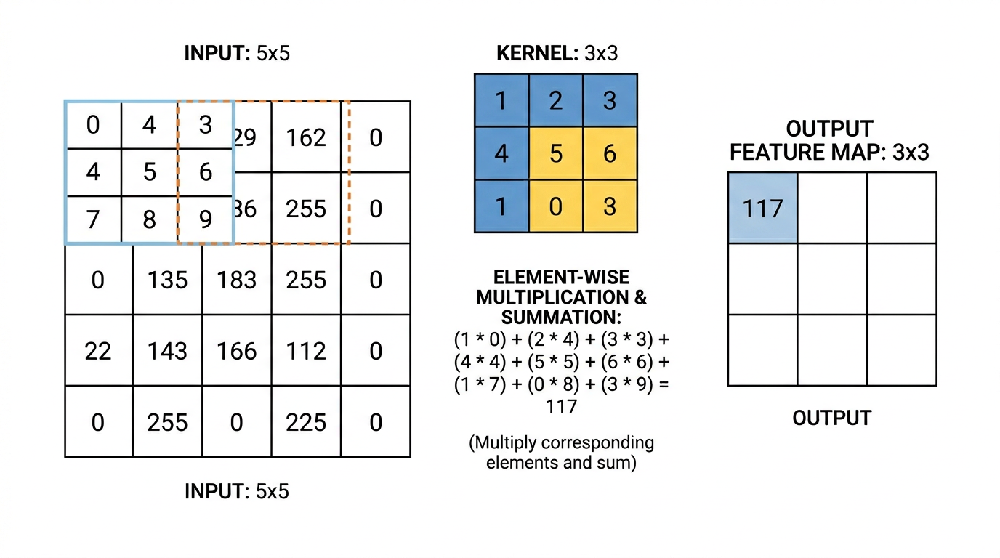
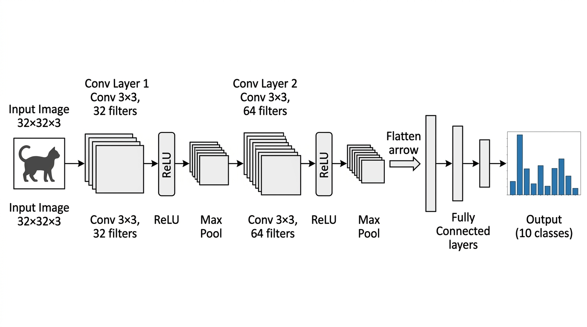
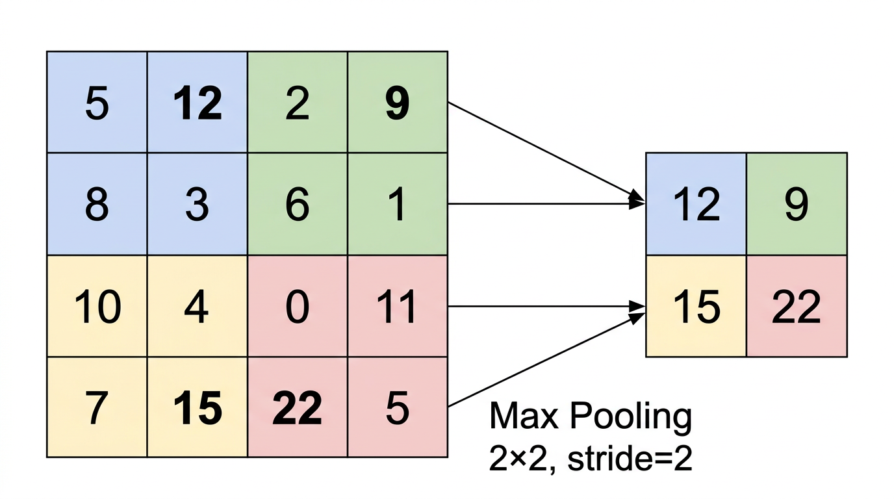
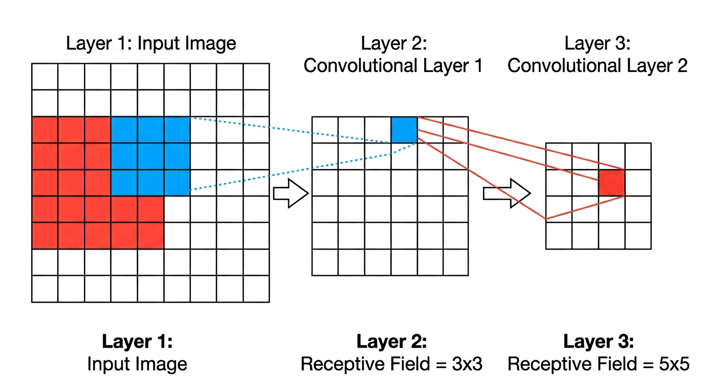

# 03 - CNN：利用图像的空间结构

> **主维度**：D1 基础架构
> **关键关系**：
> - CNN (架构) --依赖--> MLP (架构)：CNN 依赖 MLP 作为学习基础
> - GCN (架构) --推广了--> CNN (架构)：GCN 推广了 CNN 的卷积从网格到图结构
> - GCN (架构) --是一种--> GNN (架构)：GCN 是一种 GNN
>
> **学习路径**：LLM/02 基础 → 深入 MLP（02） → **本章** → RNN/LSTM → 训练数学
>
> **前置知识**：MLP 结构、反向传播、权重初始化、残差连接（02 已覆盖）；线性代数（矩阵运算）
>
> **参考**：
> - [Wikipedia - Convolutional neural network](https://en.wikipedia.org/wiki/Convolutional_neural_network)
> - [d2l.ai Ch.7 - 卷积神经网络](https://d2l.ai/chapter_convolutional-neural-networks/index.html)
> - [Deep Learning Book Ch.9 - Convolutional Networks](https://www.deeplearningbook.org/contents/convnets.html)

---

## 引言：为什么不能直接用 MLP 处理图像？

上一章我们学了如何让深层 MLP 训练起来。但即使训练技术完美，MLP 也不适合直接处理图像。原因很简单——**参数量爆炸**。

一张 $256 \times 256$ 的 RGB 彩色图像有 $256 \times 256 \times 3 = 196{,}608$ 个像素值。如果第一个隐藏层有 1000 个神经元（这已经不算多），全连接层就需要 $196{,}608 \times 1{,}000 \approx 2 \times 10^8$ 个权重——仅第一层就有 **2 亿参数**。

这不只是计算量的问题。这么多参数意味着：
1. **内存装不下**：网络总参数量轻松超过数十亿
2. **严重过拟合**：参数量远超训练数据量，网络会记住训练数据而不是学到规律
3. **没有利用图像的结构**：MLP 把图像拉成一维向量，完全丢失了像素之间的空间关系——旁边的两个像素和相距千里的两个像素被同等对待

**CNN（Convolutional Neural Network，卷积神经网络）**就是为解决这个问题而设计的。它利用图像数据的两个关键特性来大幅减少参数量：**局部性**和**平移不变性**。

> **可靠程度**：Level 1（教科书共识）

---

## 1. 卷积操作

### 1.1 从物理中的卷积说起

如果你学过信号处理或数学物理，你可能见过**卷积**（convolution）这个概念：两个函数 $f$ 和 $g$ 的卷积定义为

$$
(f * g)(t) = \int_{-\infty}^{\infty} f(\tau)\, g(t - \tau)\, d\tau
$$

直觉：把 $g$ 翻转后在 $f$ 上滑动，每个位置算两个函数重叠部分的"加权面积"。物理中常见的例子是测量仪器的响应函数对信号的平滑效果。

CNN 中的卷积是这个概念的**离散二维版本**。不过严格来说，CNN 中做的是**互相关**（cross-correlation）而不是卷积（省略了翻转步骤），但深度学习领域习惯叫它"卷积"。这个区别不影响学习，因为卷积核的参数是学出来的，翻不翻转没有本质区别。

### 1.2 离散二维卷积的数学定义

设输入是一个二维矩阵 $\mathbf{X}$（比如一张灰度图像），卷积核（kernel / filter）是一个小矩阵 $\mathbf{K}$，大小为 $k_h \times k_w$（通常是 $3 \times 3$ 或 $5 \times 5$）。输出 $\mathbf{Y}$ 的每个元素定义为：

$$
Y_{i,j} = \sum_{p=0}^{k_h-1} \sum_{q=0}^{k_w-1} K_{p,q} \cdot X_{i+p,\, j+q}
$$

用文字说：**把卷积核放在输入的 $(i,j)$ 位置上，对应元素相乘再相加，得到输出的一个值**。然后把卷积核滑到下一个位置，重复这个操作。



> **交互式演示**：[CS231n Convolution Demo](https://cs231n.github.io/convolutional-networks/) 页面有一个可以逐步查看卷积核滑动过程的动态演示。

### 1.3 一个具体例子：边缘检测

这比公式直观得多。考虑一个 $3 \times 3$ 的**水平边缘检测核**：

$$
\mathbf{K} = \begin{bmatrix} 1 & 1 & 1 \\ 0 & 0 & 0 \\ -1 & -1 & -1 \end{bmatrix}
$$

把它在图像上滑动。在一个**上方亮、下方暗**的区域（比如一条水平边缘），上面三个像素值大（乘以 +1），下面三个像素值小（乘以 -1），相加后得到一个大的正数。在均匀区域，上下差不多，相加后接近零。

所以这个核的效果是：**输出大的位置 = 输入中有水平边缘的位置**。

类似地，换一个核就能检测垂直边缘、对角线、角点等。在 CNN 中，卷积核的值不是人工设计的，而是**通过训练自动学习**的。网络自己学会最有用的特征检测器。

### 1.4 步幅和填充

两个控制卷积行为的超参数：

- **步幅（stride）**：卷积核每次滑动多少格。stride=1 是每次移一格（最密），stride=2 是每次移两格（输出尺寸减半）。
- **填充（padding）**：在输入边缘补零。如果不补零，每做一次卷积输出尺寸会缩小。padding="same" 意味着补足零使输出和输入尺寸相同。

输出尺寸的公式：

$$
n_{\text{out}} = \left\lfloor \frac{n_{\text{in}} + 2p - k}{s} \right\rfloor + 1
$$

其中 $n_{\text{in}}$ 是输入尺寸，$k$ 是核大小，$s$ 是步幅，$p$ 是填充大小。

> **参考**：[d2l.ai §7.3 - Padding and Stride](https://d2l.ai/chapter_convolutional-neural-networks/padding-and-strides.html)

---

## 2. CNN 的两个关键先验（Inductive Bias）

在 01-overview 中我们说过：每种网络架构都是在把数据的**结构先验**（inductive bias）编码到网络中。CNN 编码了两个关于图像的先验：

### 2.1 局部性（Locality）

**一个像素的"含义"主要由它附近的像素决定**。你不需要看整张图的左上角来判断右下角是不是一只眼睛——只需要看右下角附近的一小块区域。

CNN 通过**小卷积核**实现局部性：每个卷积核只看 $3 \times 3$ 或 $5 \times 5$ 的局部区域，而不是像全连接层那样连接所有输入像素。

### 2.2 平移不变性（Translation Invariance）

**同一个特征可以出现在图像的任何位置**。一只猫在图像左上角和右下角，"猫的特征"是一样的。

CNN 通过**权值共享**（weight sharing）实现平移不变性：**同一个卷积核在图像的所有位置使用完全相同的权重**。不管边缘出现在哪里，检测它的"探测器"都是同一组参数。

### 2.3 参数量的巨大节省

这两个先验直接带来了参数量的巨大减少：

| 设置 | 连接方式 | 参数量 |
|---|---|---|
| 全连接层（MLP） | 每个输出连接所有 196,608 个输入 | $\sim 2 \times 10^8$（一层） |
| 卷积层（CNN） | 每个输出只连接 $3 \times 3 = 9$ 个输入，所有位置共享 | $3 \times 3 \times 1 = 9$（一个核） |

当然一个卷积层通常有多个核（比如 64 个），但即使 64 个 $3 \times 3$ 核也只有 $64 \times 9 = 576$ 个参数——比全连接的 2 亿少了**5 个数量级**。

> **可靠程度**：Level 1（教科书共识）
>
> **参考**：[Wikipedia - Inductive bias](https://en.wikipedia.org/wiki/Inductive_bias) · [d2l.ai §7.1 - From Fully Connected Layers to Convolutions](https://d2l.ai/chapter_convolutional-neural-networks/why-conv.html)

---

## 3. CNN 的组件

一个完整的 CNN 由以下组件交替堆叠而成：



### 3.1 卷积层：特征图与多通道

一个卷积核在输入图像上滑动，产生一个**特征图**（feature map）——它是一个和输入大小接近的二维矩阵，每个位置的值表示"这个位置有多像卷积核检测的特征"。

使用多个卷积核，就能检测多种不同的特征（边缘、角点、纹理等），每个核产生一个特征图，合在一起形成**多通道**输出。

更一般地：如果输入有 $C_{\text{in}}$ 个通道（比如 RGB 图像 $C_{\text{in}} = 3$），每个卷积核的大小实际上是 $C_{\text{in}} \times k_h \times k_w$（在所有输入通道上做卷积再求和）。如果有 $C_{\text{out}}$ 个这样的核，则输出有 $C_{\text{out}}$ 个通道。一个卷积层的总参数量为：

$$
\text{参数量} = C_{\text{out}} \times (C_{\text{in}} \times k_h \times k_w + 1)
$$

其中 $+1$ 是偏置项。

### 3.2 池化层（Pooling）

池化层用于**降低特征图的空间分辨率**，同时保留最重要的信息。

- **Max Pooling**：在一个小区域（如 $2 \times 2$）内取最大值。直觉：只要区域内有这个特征，就保留它，忽略精确位置。
- **Average Pooling**：在小区域内取平均值。更平滑但可能模糊掉弱特征。

Max Pooling $2 \times 2$, stride=2 会把特征图的长宽各缩小一半，参数量为零（没有可学习参数）。



池化的好处：
1. 减小特征图尺寸 → 减少后续层的计算量
2. 增大**感受野**（见下文）
3. 提供一定的平移不变性（特征的精确位置稍有偏移，池化后的结果不变）

### 3.3 感受野（Receptive Field）

**感受野**是指深层网络中一个神经元"看到"的**输入图像区域有多大**。

第一个卷积层的每个神经元看到一个 $3 \times 3$ 的输入区域。第二个卷积层的每个神经元看到第一层的 $3 \times 3$ 区域，而第一层的每个神经元又看到输入的 $3 \times 3$ 区域——所以第二层的感受野是 $5 \times 5$。

**为什么是 5×5 而不是 9×9？** 因为相邻神经元的感受野是**重叠**的。用一维说明：

```
stride = 1, kernel = 3:
  第一层神经元 A → 看输入 [0, 1, 2]
  第一层神经元 B → 看输入 [1, 2, 3]    ← 和 A 重叠了 [1,2]
  第一层神经元 C → 看输入 [2, 3, 4]    ← 和 B 重叠了 [2,3]

第二层一个神经元看 [A, B, C] → 合并覆盖 [0,1,2,3,4] = 5 个位置
```

每层只新增 $k - 1$ 个位置（$k$ 是 kernel 大小），所以 $L$ 层 $k \times k$ 卷积（stride=1）的感受野 = $L(k-1) + 1$：

- 1 层 3×3 → $1 \times 2 + 1 = 3$
- 2 层 3×3 → $2 \times 2 + 1 = 5$
- 3 层 3×3 → $3 \times 2 + 1 = 7$（等效于一个 7×7 kernel，但参数更少——这就是 VGGNet 的核心思想）

#### stride 和池化对感受野的影响

stride 越大 → 重叠越少 → 感受野增长越快：

```
stride = 2, kernel = 3:
  神经元 A → [0, 1, 2]
  神经元 B → [2, 3, 4]    只重叠 1 个
  神经元 C → [4, 5, 6]    只重叠 1 个

第二层看 [A, B, C] → 合并覆盖 [0-6] = 7 个位置（vs stride=1 时的 5 个）
```

**Max Pooling（stride=2）能加速感受野增长**——它把分辨率砍半，等于让后续所有层的 stride 都翻倍。实际 CNN 中，感受野的快速扩大主要靠池化层和带 stride 的卷积。

考虑每层不同 kernel 和 stride 的完整公式：

$$r_n = 1 + \sum_{i=1}^{n} (k_i - 1) \cdot \prod_{j=1}^{i-1} s_j$$

其中 $k_i$ 是第 $i$ 层的 kernel 大小，$s_j$ 是第 $j$ 层的 stride。stride 的影响是**乘法**的（$\prod$），所以即使只有一层用了 stride=2，后面所有层的感受野增长都翻倍。



这意味着**浅层神经元检测小尺度特征（边缘、角点），深层神经元检测大尺度特征（纹理、物体部件、整个物体）**——自然形成了从低级到高级的特征层次。

> **可靠程度**：Level 1（教科书共识）
>
> **参考**：[d2l.ai §7.5 - Pooling](https://d2l.ai/chapter_convolutional-neural-networks/pooling.html) · [Wikipedia - Receptive field (neural networks)](https://en.wikipedia.org/wiki/Receptive_field#In_neural_networks)

---

## 4. 经典 CNN 架构演进

CNN 的发展史是深度学习历史的缩影。每一代架构都解决了前一代的关键瓶颈。

### 4.1 LeNet-5（1998）— 开山之作

**核心创新**：第一个成功的 CNN 架构，用于手写数字识别（MNIST 数据集，$28 \times 28$ 灰度图像）。

**结构**：2 个卷积层 + 2 个池化层 + 3 个全连接层。总共约 60,000 个参数。

**意义**：证明了卷积+池化的组合可以自动学习图像特征，不需要手工设计特征。但由于当时计算力不足，CNN 在之后十多年里没有成为主流。

> **参考**：[LeCun et al., 1998 - "Gradient-Based Learning Applied to Document Recognition"](http://yann.lecun.com/exdb/publis/pdf/lecun-98.pdf) · [Wikipedia - LeNet](https://en.wikipedia.org/wiki/LeNet)

### 4.2 AlexNet（2012）— 深度学习的引爆点

**核心创新**：深层 CNN（8 层）+ GPU 训练 + ReLU 激活 + Dropout 正则化。

**背景**：ImageNet 是一个大规模图像分类竞赛，包含 1000 个类别、超过 100 万张图像（$224 \times 224$ RGB）。2012 年之前，最好的方法是手工特征（如 SIFT）+ SVM 分类器，top-5 错误率约 26%。

**AlexNet 的成绩**：top-5 错误率 **15.3%**——比第二名低了 10 个百分点。这个巨大的突破让整个计算机视觉领域转向了深度学习。

**参数量**：约 6000 万。

> **参考**：[Krizhevsky et al., 2012 - "ImageNet Classification with Deep Convolutional Neural Networks"](https://papers.nips.cc/paper/2012/hash/c399862d3b9d6b76c8436e924a68c45b-Abstract.html) · [Wikipedia - AlexNet](https://en.wikipedia.org/wiki/AlexNet)

### 4.3 VGGNet（2014）— 更深更规则

**核心创新**：把所有卷积核统一为 $3 \times 3$，靠堆叠深度来增加感受野。

VGG 的关键洞察：两个 $3 \times 3$ 卷积层的感受野等于一个 $5 \times 5$ 卷积层，三个 $3 \times 3$ 等于一个 $7 \times 7$——但参数量更少，非线性更多。

$$
3 \times (3^2 C^2) = 27C^2 \quad \text{vs} \quad 7^2 C^2 = 49C^2
$$

（其中 $C$ 是通道数，$3 \times 3$ 卷积核有 $9C^2$ 个参数，三个这样的层共 $27C^2$；而一个 $7 \times 7$ 层有 $49C^2$ 个参数。）

**深度**：VGG-16 有 16 层（含权重的层），VGG-19 有 19 层。

**参数量**：约 1.38 亿。大部分参数在最后几个全连接层中。

> **参考**：[Simonyan & Zisserman, 2014 - "Very Deep Convolutional Networks for Large-Scale Image Recognition"](https://arxiv.org/abs/1409.1556)

### 4.4 ResNet（2015）— 残差连接突破 100+ 层

你在 02-deep-mlp.md 中已经学了残差连接的原理。ResNet 就是把这个技术应用到 CNN 中。

**核心创新**：残差连接让网络深度从 ~20 层突破到 152 层（甚至 1000+ 层的实验也成功了）。

**成绩**：ImageNet top-5 错误率 **3.57%**——超过了人类的平均水平（约 5.1%）。

**ResNet 的残差块结构**：

```
输入 x ──→ Conv → BN → ReLU → Conv → BN ──→ (+) → ReLU → 输出
   │                                          ↑
   └────────── skip connection ───────────────┘
```

> **参考**：[He et al., 2015 - "Deep Residual Learning for Image Recognition"](https://arxiv.org/abs/1512.03385) · [Wikipedia - Residual neural network](https://en.wikipedia.org/wiki/Residual_neural_network)

### 4.5 后续发展（简要提及）

| 架构 | 年份 | 核心创新 |
|---|---|---|
| **GoogLeNet / Inception** | 2014 | 多尺度卷积并行（$1\times1$, $3\times3$, $5\times5$ 同时用，拼接输出） |
| **DenseNet** | 2017 | 每层和所有之前的层都有 skip connection（不是加法，而是拼接通道） |
| **EfficientNet** | 2019 | 用 NAS（神经架构搜索）同时优化深度、宽度和输入分辨率 |

> **参考**：[Inception - Szegedy et al., 2015](https://arxiv.org/abs/1409.4842) · [DenseNet - Huang et al., 2017](https://arxiv.org/abs/1608.06993) · [EfficientNet - Tan & Le, 2019](https://arxiv.org/abs/1905.11946)

---

## 5. 参数量对比：MLP vs CNN

让我们做一个具体的计算，看看 CNN 到底省了多少参数。

**任务**：分类 $32 \times 32$ RGB 图像（CIFAR-10 数据集，10 个类别）。

### MLP 方案

输入维度：$32 \times 32 \times 3 = 3{,}072$。

| 层 | 输入 → 输出 | 参数量 |
|---|---|---|
| 全连接 1 | 3072 → 512 | $3{,}072 \times 512 + 512 = 1{,}573{,}376$ |
| 全连接 2 | 512 → 256 | $512 \times 256 + 256 = 131{,}328$ |
| 全连接 3 | 256 → 10 | $256 \times 10 + 10 = 2{,}570$ |
| **总计** | | **1,707,274** |

### CNN 方案

| 层 | 配置 | 参数量 |
|---|---|---|
| Conv 1 | $3 \to 32$ 通道，$3 \times 3$ | $32 \times (3 \times 9 + 1) = 896$ |
| Conv 2 | $32 \to 64$ 通道，$3 \times 3$ | $64 \times (32 \times 9 + 1) = 18{,}496$ |
| MaxPool | $2 \times 2$ | $0$ |
| Conv 3 | $64 \to 128$ 通道，$3 \times 3$ | $128 \times (64 \times 9 + 1) = 73{,}856$ |
| MaxPool | $2 \times 2$ | $0$ |
| 全连接 | $128 \times 8 \times 8 \to 10$ | $8{,}192 \times 10 + 10 = 81{,}930$ |
| **总计** | | **175,178** |

CNN 的参数量约为 MLP 的 **1/10**，而且在图像分类任务上准确率远高于 MLP。图像更大时（如 $224 \times 224$），差距会扩大到**几个数量级**。

---

## 6. 和 Transformer 的联系：Vision Transformer（ViT）

2020 年，Dosovitskiy et al. 提出了 **Vision Transformer (ViT)**：直接把 Transformer（你在 LLM 中学过的架构）应用到图像上。

做法是把图像切成 $16 \times 16$ 的小块（patch），把每个 patch 展开为一个向量，当作"token"输入 Transformer。这样 Transformer 的 Self-Attention 可以在所有 patch 之间建立全局联系。

**ViT vs CNN 的关键区别**：

| | CNN | ViT |
|---|---|---|
| 先验（Inductive Bias） | 强：局部性 + 平移不变性 | 弱：几乎没有图像特有的先验 |
| 数据需求 | 较少数据就能训好 | 需要大量数据（如 ImageNet-21k 或 JFT-300M） |
| 全局关系 | 需要很多层才能看到全局 | 每一层都能看到全局（Attention） |

ViT 说明了一个深刻的观点：如果数据足够多，**不需要把先验硬编码到架构中**——模型可以自己学到局部性和平移不变性。但数据不够时，CNN 的先验仍然是宝贵的。

> **可靠程度**：Level 1-2（ViT 的有效性已被广泛验证，但"多少数据才够"的边界仍在研究中）
>
> **参考**：[Dosovitskiy et al., 2020 - "An Image is Worth 16x16 Words"](https://arxiv.org/abs/2010.11929) · [Wikipedia - Vision Transformer](https://en.wikipedia.org/wiki/Vision_transformer)

---

## 总结

CNN 的核心思想是：**利用图像数据的空间结构（局部性 + 平移不变性）来设计高效的网络架构**。

| 概念 | 作用 |
|---|---|
| 卷积核 | 局部特征检测器，参数共享 |
| 多通道 | 同时检测多种特征 |
| 池化 | 降分辨率，增大感受野 |
| 残差连接 | 突破深度限制（ResNet） |
| 层次化特征 | 浅层 → 边缘，深层 → 物体 |

从 LeNet 到 ResNet 的 17 年演进，核心线索是**更深、更高效、更好训练**。而 Vision Transformer 的出现提出了一个挑战：当数据足够多时，精心设计的先验是否还有必要？

下一章我们将学习 RNN——专门处理**序列数据**的架构，它利用了与 CNN 完全不同的数据先验。

---

### 公式速查卡

| 公式 | 含义 |
|------|------|
| $n_{\text{out}} = \lfloor\frac{n_{\text{in}} + 2p - k}{s}\rfloor + 1$ | 卷积/池化输出尺寸 |
| 卷积层参数量 = $C_{\text{out}} \times (C_{\text{in}} \times k_h \times k_w + 1)$ | $+1$ 是偏置 |
| $L$ 层 $k \times k$ 卷积的感受野 = $L(k-1) + 1$ | stride=1 时 |
| 完整感受野：$r_n = 1 + \sum_{i=1}^{n}(k_i-1)\prod_{j=1}^{i-1}s_j$ | 考虑不同 stride |
| 两个 3×3 参数量 = $2 \times 9C^2 = 18C^2$ | vs 一个 5×5 = $25C^2$ |

**记忆技巧**：输出尺寸公式的分子 = 有效长度（加了 padding，减去 kernel 占的空间），除以 stride = 能放几个位置，再 +1

---

## 理解检测

**Q1**：一个 $5 \times 5$ 卷积核和两个 $3 \times 3$ 卷积核堆叠起来，感受野大小相同（都是 $5 \times 5$）。那为什么 VGGNet 选择用两个 $3 \times 3$ 而不是一个 $5 \times 5$？请从参数量和非线性两个角度分析。

> 提示：查速查卡对比 $18C^2$ vs $25C^2$；两个 3×3 之间多了什么？

你的回答：


**Q2**：CNN 通过权值共享实现平移不变性——同一个卷积核在所有位置使用相同的权重。但考虑人脸检测：人脸通常在图像上半部分，背景在下半部分。这种情况下，"所有位置使用相同权重"是否是一个好假设？ViT 如何处理这个问题？

你的回答：


**Q3**：假设你有一个单通道（灰度）$8 \times 8$ 输入图像，用一个 $3 \times 3$ 卷积核（stride=1, padding=0）做卷积，得到的输出特征图大小是多少？如果再接一个 $2 \times 2$ Max Pooling（stride=2），输出大小又是多少？

> 提示：用公式 $n_{\text{out}} = \lfloor\frac{n_{\text{in}} + 2p - k}{s}\rfloor + 1$，分两步算：先卷积（$n=8, p=0, k=3, s=1$），再池化（$k=2, s=2$）

你的回答：


