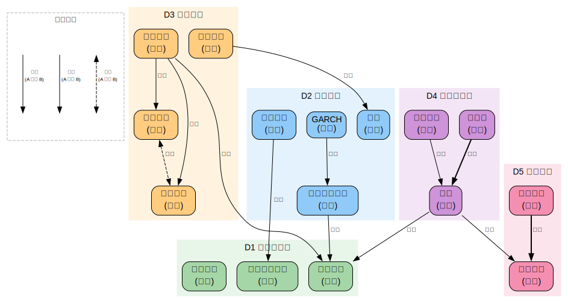

# 量化投资

> 创建日期：2026-03-12

## 背景与起点

- **已有知识**：Python 熟练（pandas/numpy/PyTorch）；数学/统计基础强（线性回归、矩阵运算、概率论、贝叶斯推断、MCMC）；金融知识零基础
- **从哪开始**：先理解金融市场的基本运作，然后进入策略开发的数学工具和方法论
- **目的**：学术研究 + 实际赚钱
- **可跳过**：Python 编程基础、线性代数、概率论基础（已在其他域覆盖）
- **需要补**：随机过程、时间序列分析——在本域穿插讲解
- **与多因子模型域的关系**：多因子模型是量化投资的一个子领域，专注资产定价理论。本域侧重策略开发理论和方法论。金融基础概念参见 `domains/factor-models/notes/02-finance-basics.md`，因子投资参见 `domains/factor-models/`

## 领域概览

量化投资用**数学模型和计算机程序**代替人的主观判断来做投资决策。核心问题链：

1. **市场有没有规律？** — 有效市场假说（EMH）认为没有；量化投资的存在本身就是在赌"有"
2. **怎么找到规律？** — 从数据中发现统计上可重复的交易信号（alpha 信号）
3. **规律是不是真的？** — 区分真信号和过拟合/数据挖掘的假信号——这是最难的部分
4. **怎么把规律变成钱？** — 策略构建、风险管理、执行系统
5. **规律会消失吗？** — 市场在适应，策略在衰减——持续研发是必要的

## 知识维度

| 维度 | 含义 | 核心问题 |
|------|------|---------|
| **D1 市场与数据** | 金融市场结构、数据类型 | 市场怎么运作？数据从哪来？ |
| **D2 数学工具** | 随机过程、时间序列分析 | 怎么用数学描述价格运动？ |
| **D3 策略理论** | 策略分类、信号构建、研发方法论 | 怎么找到可重复的交易信号？ |
| **D4 风险与评估** | 风险管理、策略评估、过拟合防范 | 怎么判断一个策略是真好还是假好？ |
| **D5 实盘工程** | 回测框架、执行系统、交易成本 | 怎么把研究变成实际交易？ |

## 知识地图

| 维度 | 学习顺序 | 一句话说明 |
|------|---------|-----------|
| **D1 市场与数据** | 市场结构 → 资产类别 → 数据类型 → 数据获取 | 了解你在哪个"游戏场"上玩 |
| **D2 数学工具** | 随机游走 → 布朗运动 → 时间序列（AR/MA/ARMA）→ 波动率建模（GARCH）| 给价格运动建数学模型 |
| **D3 策略理论** | 策略分类 → 动量/均值回复 → 统计套利 → 信号构建 → 组合优化 | 从发现规律到构建策略 |
| **D4 风险与评估** | 评估指标 → 回测陷阱 → 过拟合 → 风险度量（VaR/CVaR）→ 仓位管理 | 区分真好和假好 |
| **D5 实盘工程** | 回测框架 → 交易成本 → 滑点 → 执行算法 → 实盘系统 | 从研究到赚钱的最后一步 |

### 关系图

> 源文件：`knowledge-graph.dot`，修改后运行 `./build-graphs.sh` 重新生成。

## 学习路径

| 序号 | 主题 | 维度 | 文件 |
|------|------|------|------|
| 1 | 全景概览 — 量化投资是什么、怎么运作 | 全部 | `01-overview.md` |
| 2 | 市场与数据 — 金融市场结构、数据类型 | D1 | `02-markets-and-data.md` |
| 3 | 数学工具（上）— 随机过程与时间序列基础 | D2 | `03-math-tools-1.md` |
| 4 | 数学工具（下）— 波动率建模与协整 | D2 | `04-math-tools-2.md` |
| 5 | 策略理论（上）— 动量、均值回复、趋势跟踪 | D3 | `05-strategy-theory-1.md` |
| 6 | 策略理论（下）— 统计套利、配对交易、机器学习策略 | D3 | `06-strategy-theory-2.md` |
| 7 | 风险管理与策略评估 | D4 | `07-risk-and-evaluation.md` |
| 8 | 回测方法论 — 框架、陷阱、过拟合 | D4+D5 | `08-backtesting.md` |
| 9 | 实盘与前沿 — 执行系统、交易成本、前沿方向 | D5 | `09-execution-and-frontiers.md` |

## 可靠度说明

| 级别 | 含义 | 例子 |
|------|------|------|
| Level 1 | 教科书共识 | 布朗运动的数学定义 |
| Level 2 | 学术主流（有少数异议） | 动量效应的存在性 |
| Level 3 | 学术争论中 | 动量的来源（风险 vs 行为） |
| Level 4 | 业界经验 | 策略容量的估算方法 |

## 推荐资源

### 入门
1. Ernest Chan,《Quantitative Trading》— 量化交易入门圣经，实操导向
2. Ernest Chan,《Algorithmic Trading》— 更深入的策略开发
3. Marcos López de Prado,《Advances in Financial Machine Learning》— ML 在量化中的应用（进阶）

### 数学工具
1. Shreve,《Stochastic Calculus for Finance I & II》— 随机过程标准教材
2. Hamilton,《Time Series Analysis》— 时间序列经典教材
3. Tsay,《Analysis of Financial Time Series》— 金融时间序列专门教材

### 策略与风控
1. Grinold & Kahn,《Active Portfolio Management》— 主动投资管理的理论框架
2. De Prado,《Machine Learning for Asset Managers》— 简洁的 ML + 投资框架

### 中国市场
1. 石川、刘洋溢、连祥斌,《因子投资：方法与实践》— 中国A股因子投资实操
2. [JoinQuant/聚宽](https://www.joinquant.com/) — 中国量化平台（免费数据+回测）
3. [RiceQuant/米筐](https://www.ricequant.com/) — 另一个中国量化平台
